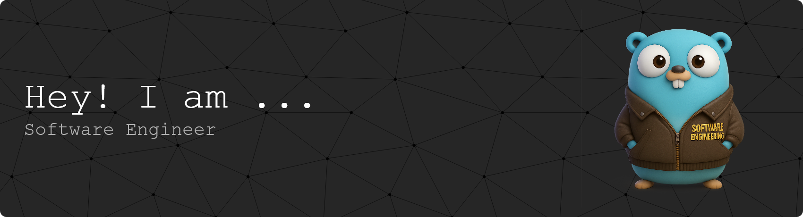

                              

 
  

  
 
<h1 align="center">João Gabriel Vianna</h1>

  Engenheiro de Software • Go and Python Developer • DevOps and Arquitechture

---

### 👨‍💻 Sobre mim  

Sou desenvolvedor **Go** e **Python**, com uma cultura **Build to Learn**: acredito que a melhor forma de evoluir é construindo.  
Tenho experiência aplicando **Clean Code**, **Hexagonal Architecture** e **Clear Architecture**, sempre com foco em soluções simples, claras e de fácil manutenção.  

Gosto de criar **APIs bem estruturadas, microsserviços organizados e pipelines que funcionam de verdade**.  
No dia a dia, atuo também com **DevOps**, CI/CD e cloud, garantindo que o software seja não só bem feito, mas também confiável e preparado para crescer.  

Para mim, tecnologia só faz sentido quando entrega **valor real** e gera impacto positivo para quem usa.

---

### 🧰 Tech Stack

#### 🔧 Backend & APIs
| Tecnologia                                                                                                                   | Nível de Proficiência      | Uso Principal                            |
| ---------------------------------------------------------------------------------------------------------------------------- | -------------------------- | ---------------------------------------- |
|      | ⭐⭐⭐⭐☆                | Microsserviços, APIs de alta performance |
|   | ⭐⭐⭐⭐☆                     | Automação, Data Pipelines, APIs          |
|  | ⭐⭐⭐☆                       | APIs rápidas, protótipos                 |
|         | ⭐⭐☆☆☆                      | Projetos acadêmicos e manutenção         |
|                                   | ⭐⭐☆☆☆                      | APIs rápidas em Python                   |

#### 💻 Frontend & Mobile
| Tecnologia                                                                                                                              | Nível de Proficiência | Uso Principal                    |
| --------------------------------------------------------------------------------------------------------------------------------------- | --------------------- | -------------------------------- |
|                 | ⭐⭐⭐⭐☆                 | Frontend Web                     |
|  | ⭐⭐⭐⭐☆                 | React + React Native             |
|          | ⭐⭐⭐⭐☆                 | Aplicações mobile cross-platform |
|           | ⭐⭐⭐☆                  | Apps mobile multiplataforma      |

### 🖥️ Outras Linguagens & Plataformas (secundárias/estudo)

| Tecnologia                                                                                              | Nível de Proficiência | Uso Principal                    |
| ------------------------------------------------------------------------------------------------------- | --------------------- | -------------------------------- |
|  | ⭐☆☆☆☆              | Projetos acadêmicos              |
|         | ⭐☆☆☆☆              | Projetos acadêmicos              |
|              | ⭐☆☆☆☆              | Prototipagem e eletrônica básica |
|       | ⭐☆☆☆☆              | Criação de Digital Twins e simulações 3D |
 

#### 🛠️ Infraestrutura & DevOps
| Tecnologia                                                                                                                                              | Nível de Proficiência | Uso Principal                |
| ------------------------------------------------------------------------------------------------------------------------------------------------------- | --------------------- | ---------------------------- |
|                              | ⭐⭐⭐⭐☆                 | Containerização e deploy     |
|                                 | ⭐⭐⭐☆                  | Proxy reverso, balanceamento |
|                                       | ⭐⭐⭐⭐☆                 | Versionamento, Git Flow      |
|                                 | ⭐⭐⭐⭐☆                 | Administração de servidores  |
|                              | ⭐⭐⭐☆                  | Deploy frontend              |
|  | ⭐⭐⭐☆                  | Cloud, serviços gerenciados  |
|                                                    | ⭐⭐☆☆☆                 | Serviços em nuvem            |
|                                                          | ⭐⭐☆☆☆                 | Cloud e banco de dados       |

#### ☁️ Cloud & Banco de Dados
| Tecnologia                                                                                                                              | Nível de Proficiência | Uso Principal                       |
| --------------------------------------------------------------------------------------------------------------------------------------- | --------------------- | ----------------------------------- |
|  | ⭐⭐⭐⭐☆                 | Queries avançadas, análise de dados |
|                 | ⭐⭐⭐☆                  | Bancos relacionais                  |
|        | ⭐⭐⭐⭐☆                 | Realtime DB, autenticação           |

---

### 📬 Vamos conversar?

- 📩 **Email:** [joaogabrielvianna05@gmail.com](mailto:joaogabrielvianna05@gmail.com)  
- 💼 **LinkedIn:** [linkedin.com/in/joaogabrielvianna](https://www.linkedin.com/in/joaogabrielvianna/)  
- 🌐 **Portfólio:** [joaogabrielvianna.com.br](https://joaogabrielvianna.com.br)

---

  <strong>🧩 Construindo soluções com propósito, performance e paixão pelo código.</strong>

